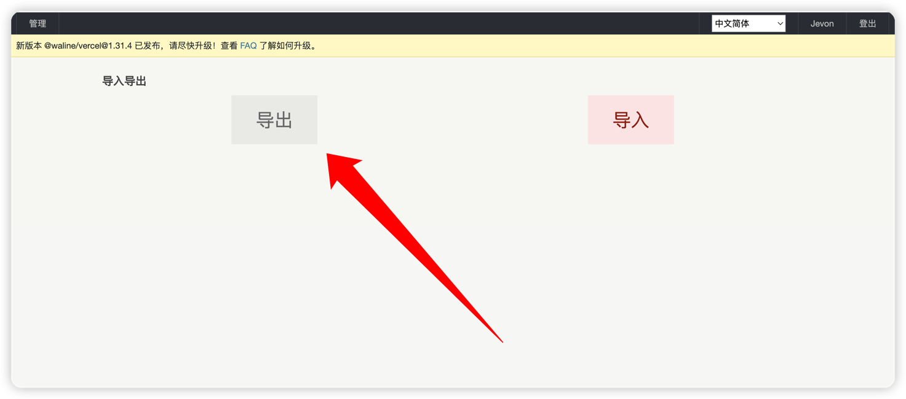
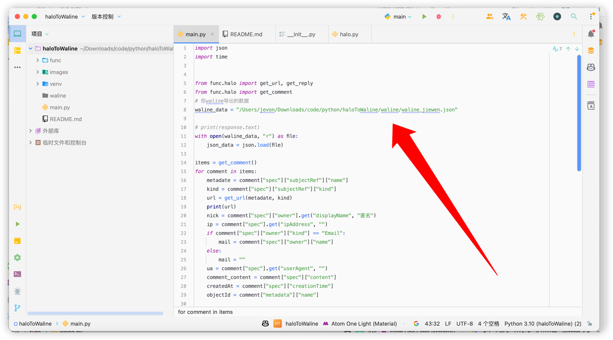
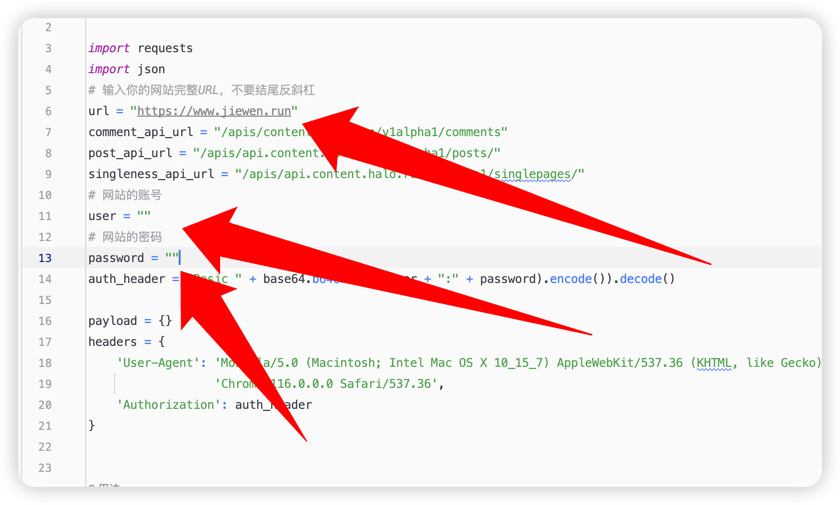
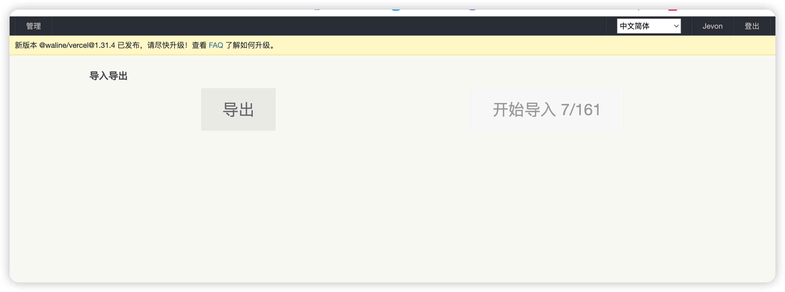

<h2 style="text-align: center">Halo默认评论转waline</h2>

### 介绍
>最近博客适配了waline评论系统，但是之前的评论都是halo自带的，所以就写了这个脚本来转换评论。
### 使用方法
首先，先从waline的后台导出你的评论，得到的会是一个JSON文件。

然后clone仓库代码到本地，这边推荐使用pycharm。

这里需要修改四个地方
- 1.`main.py`中的`waline_data`改为你导出的JSON文件的路径，相对，绝对路径随你。
- 2.`/func/halo.py`中的`url` `user` `password`改为你的halo的地址，用户名，密码。

- 最后回来运行main.py即可，运行完后新的JSON保存在`/waline`中
- 然后再回去导入即可。

### 注
我用的是LeanCloud 国际版+vercel，其他自测
